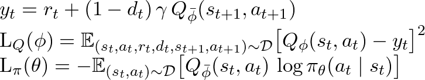

# GLIDER Algorithm Directory (`alg/`)

This directory contains the core algorithms for the GLIDER (Grounding LLMs as Efficient Decision-Making Agents via Offline Hierarchical Reinforcement Learning) framework. GLIDER uses a hierarchical approach to train language models to act as decision-making agents.

## Files Overview

### Base Algorithms

- **`bc.py`** — Behavioral Cloning implementation
  - Basic imitation learning algorithm
  - Trains models to mimic expert demonstrations

- **`ac.py`** — Actor-Critic implementation
  - Standard actor-critic reinforcement learning algorithm
  - Uses a value function (critic) to update a policy (actor)

- **`awac.py`** — Advantage-Weighted Actor-Critic implementation
  - Extends Actor-Critic with advantage weighting
  - Balances between imitation learning and reinforcement learning

### GLIDER Implementations

- **`glider_bc.py`** — GLIDER with Behavioral Cloning
  - Hierarchical BC for high-level (task decomposition) and low-level (action execution) policies
  - Uses supervised learning on demonstration data

- **`glider_awac.py`** — GLIDER with AWAC
  - Incorporates critic networks to estimate value functions
  - Optimizes both high-level and low-level policies with advantage weighting
  - Discrepancy with the paper:
    - The implementation trains the low level only with BC even during the AWAC period and the high level policy's V network is missing meaning that there is no real computation of advantage and only the Q network is used to compute it. The exponential weighting is mentioned in the algorithm but not applied practically.
    - Algorithm:
      - 
    - The low level is trained literally in the same way as it is trained during BC in the previous phase.
  - This method essentially assumes that LLMs can learn how to fulfill subtasks with imitation learning and it mainly focuses on training the policy network (LLLM) to become a better high level planner given the code, which is not exactly described in the theory. The theory mentions that these two components both require actor-critic architecture to fully learn planning given a hierarchy...


- **`glider_o2o.py`** — GLIDER Online-to-Offline
  - Online fine-tuning extension of GLIDER
  - Adapts pre-trained models to new domains through online interaction

### Evaluation

- **`eval_policy.py`** — General policy evaluation
  - Evaluates trained policies on environment tasks
  - Computes metrics like rewards and scores

- **`eval_glider.py`** — GLIDER-specific evaluation
  - Evaluates GLIDER's hierarchical policies
  - Includes data collection functionality for offline learning

---

## Algorithm Sketches

### Behavioral Cloning (BC)
```text
1. Initialize policy network π_θ
2. For each training iteration:
   a. Sample batch of demonstrations (s, a) from dataset D
   b. Compute log probability of actions log π_θ(a|s)
   c. Update policy by maximizing log probability: θ ← θ + α∇_θ E[log π_θ(a|s)]
```

### Advantage-Weighted Actor-Critic (AWAC)
```text
1. Initialize actor network π_θ and critic network Q_φ
2. For each training iteration:
   a. Sample batch of transitions (s, a, r, s') from dataset D
   b. Update critic Q_φ by minimizing TD error:
      L(φ) = E[(Q_φ(s,a) - (r + γV(s')))²]
   c. Compute advantage A(s,a) = Q_φ(s,a) - V(s)
   d. Update actor by maximizing advantage-weighted log probability:
      L(θ) = E[exp(A(s,a)/λ) * log π_θ(a|s)]
   e. Soft update target networks
```

### GLIDER Hierarchical Framework
```text
1. Initialize high-level policy π_H and low-level policy π_L
2. Initialize critic networks if using AWAC
3. For each training iteration:
   a. Sample hierarchical trajectories from dataset:
      - High level: (task_desc, obs, subtask, reward)
      - Low level: (subtask, obs, action, reward)
   b. If using BC:
      - Update π_H to predict subtasks given task description and observations
      - Update π_L to predict actions given subtask and observations
   c. If using AWAC:
      - Update critics to estimate values
      - Update π_H and π_L with advantage weighting
      - Apply soft updates to target networks
```

### Online-to-Offline (O2O)
```text
1. Load pre-trained GLIDER model (from BC or AWAC)
2. For each training iteration:
   a. With probability p:
      - Sample batch from offline dataset
      - Update models with offline data
   b. With probability 1-p:
      - Collect new experiences by interacting with environment
      - Add new experiences to buffer
      - Update models with newly collected data
   c. Periodically evaluate and save checkpoints
```

Each algorithm uses DeepSpeed for distributed training and integrates with TensorBoard for logging metrics like losses, rewards, and scores during training.
